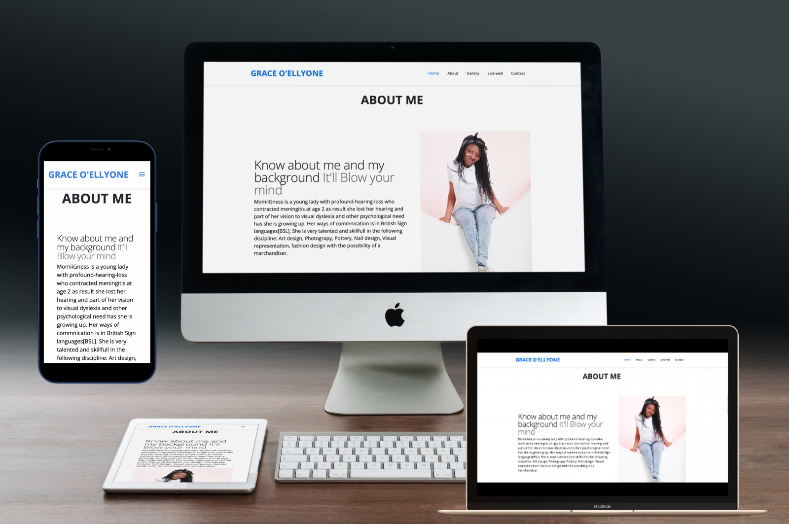
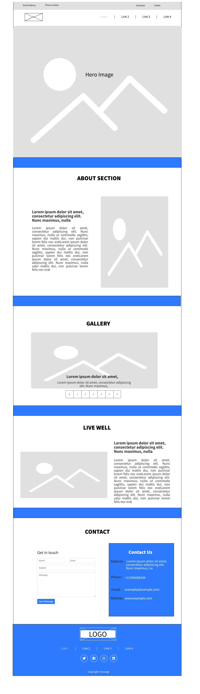

## Project Title: MomiiGness Expo!

 

## Users Stories:
MomiiGness is a young lady with profound-hearing-loss who contracted meningitis at age 2 as result she lost her hearing and part of her vision to visual dyslexia and other psychological need has she is growing up.
Her ways of commnication is in British Sign languages[BSL].
She is very talented and Skillfull in the following discipline:
1. Art design, 
2. Photograpy,
3. Pottery, 
4. Nail design, 
5. Visual representation and 
6. fashion design with the possibility of a merchandiser.

## Purpose: 
MomiiGness had some workdone when she was in her secondary school which she unable to retrieve again because of her psycological breakdown as a result of a blow to her head on a school trip at age 16 which had lost her memory during the accident. By the she regain herself she had lost another 3years to remember her password to her college prtfolio and her school then, had removed the hardwork from the school website, again, dissapointing!!!

## Goal:
I am embarking on this project to assist in realising her potentials and showcase MomiiGness' talents and skills for future employement possibly for apprentiship

## What is UX:
There is a process and structure behind generating  the conditions for a positive user experience.UX is concerned with the creation of products which are useable and valuable. UX otherwise known as a User Center design is not just a step but a process. Using the Balsami wireframes, I was able to implement the processes to plan this Project with the principles behind the five plan as a start up for designing MomiiGness Expo! project from bottom to Top
1. Strategy: In achieving MomiiGness Expo!
2. Scope : in testing
3. structure: overview diagram of the design
4. Skeleton: Architectural approach in designing MomiiGness Expo!
5. Surface: Visual software presentation to the user after Deployment. 
[Link to Balsamiq wireframes](file:///C:/Users/admin/Documents/webpract/momiigness1.pdf)

## Existing Features
As a user type, reflecting on the momiiGness Expo! Web development using HTML/CSS and Bootstrap, I want to be able to navigate through the menu item below
•	Home page 
•	AboutMe
•	My Skills
•	LiveWell
•	ContactMe 
Without any glitch or irresponsive pages I was able to deriving a code that links all pages for a responsive UX pages. For example
 
<a href="https://graceobaellyone.github.io/momigness/#about-section" target="_blank">About Me</a>

                                
<a href="https://graceobaellyone.github.io/momigness/#skills-section" target="_blank">My Skills</a>

                            
<a href="https://graceobaellyone.github.io/momigness/#live-section" target="_blank">Live Well</a>

                        
<a href="https://graceobaellyone.github.io/momigness/#contact-section" target="_blank">Contact Me</a>

                    

Also, the Navigating Menu such as Home , about , my skills, livewell and contact  is another feature on the page which I derived a code that will allow user to be able to navigate the pages to the net page or the previous page without the need to good to the the home page menu. 
                <button class="navbar-toggler" type="button" data-toggle="collapse" data-target="#navbarTogglerDemo01" aria-controls="navbarTogglerDemo01" aria-expanded="false" aria-label="Toggle navigation">
            
        
    

At the start of this momiiGness Expo! Project I was able to visualise the output of the user requirement before going into technical details of the development . I used the following resource 
•	Pencil
•	Measuring rule 
•	Eareser
•	Coloring pen 
See diagram in Link below 
https://documentcloud.adobe.com/link/track?uri=urn:aaid:scds:US:d6f6b408-a40b-4860-a859-3560a6721dc3

## Features

In this section, I will go over the different feature of the project, 
•	Home page
The homepage consist of  
o	Greatness.jpg 
o	Welcome.jpg
o	Link Menu for AboutMe, GalleryWall, 
https://graceobaellyone.github.io/momigness/#about-section
•	AboutMe

Consist of user story of the owner. In order to go to the next page click next button
https://graceobaellyone.github.io/momigness/#about-section

•	My Skills
This consist of owner artwork display on the My Skills
https://graceobaellyone.github.io/momigness/#skills-section

•	LiveWell
LiveWell page consist of JuicePlus+ image. When user click on the image or the JuicePlus+ link it will be linked with an external website of the owner’s health product. Clicking on the Next button will take the user to the “ContactMe” page however if the user want more information on the prior page “AboutMe” page the ‘Previous’ button will take the user back.

https://graceobaellyone.github.io/momigness/#live-section

•	ContactMe 
Consist of feedback form with user input of Full name, email and mobile contact can be found.  When user date input had being completed the submit button will be clicked to submit the for the proceed back yo the home page.

- https://graceobaellyone.github.io/momigness/#contact-section
 
In addition, in future I plans to work more on the Gallery Wall to include link that will describe what the picture for.

### Features Left to Implement
I was unable to include the following in my project however this will be reviewed in the future development
•	Blog missing 
•	A video column for British Sign Language

•	## Technologies Used

In this section, I was able to make use the following languages to develop my site  
•	CSS
•	HTML
frameworks
•	Bootstrap – It was use as a my starting point for my project
https://getbootstrap.com/docs/4.0/getting-started/introduction/#starter-template
libraries : 
•	W3Schools – It was use to select color
https://www.w3schools.com/tags/ref_colornames.asp

•	HTML /CSS code validator – It was used to validate my code and to detect errors
https://validator.w3.org/nu/#textarea

# Wireframe
                 
 
                 
                 
## Testing
In this section, I was able to test the functionality of the momiiGness Expo! Project  
manually by varying the code to actualise UX response to each page, as a result, I was able to derive some the following 
•	Test Plan – With Project name momiiGness Expo! I was able to create 
o	Test plan reference to be able to track the project in future
o	Test Condition to analyse what functionality of the Project
o	Test case Description and assumptions. 
Further, I developed Test Cases to validate and invalidate the end UX by creating the following for each pages of the momiiGness Expo!
•	Test Case Scenario
•	Test cases Steps
•	Expected result 
•	Actual result
In the future I will to use manual software testing tools such as Jira or HP to. 
For example I was able to validate and invalidate SUBMIT functionality using the following steps
1. Contact form:
    1. Go to the "Contact Me" page
    2. Verify that if user input  
•	Full name 
•	Email 
•	Phone contact are readable on the form
    3. Submit the form to valid all the all three data input above disappears    
   4.  Invalidate that user input will not submit without SUBMIT command
•	Full name 
•	Email 
•	Phone contact are readable on the form
The form will be static.
In addition, my net phase of development will be to carry out test on different browsers and screen sizes. Also how I can improve on my project testing tools. Development of test case will help in detecting bugs, also using different test environment will minimise the same bug re-appearing again as a result of regression testing. 

## Deployment

According to
 https://softwareengineering.stackexchange.com/questions/344184/what-is-the-difference-between-software-deployment-and-software-release.

Deployment refers to getting program to a running state on a server, however it doesn't need to be the production server. One can  deploy released code, or code that is not  ready for release. In web development, it is common to deploy code to a test environment before testing it. Therefore in order to deploy my repo to github, the following steps were followed
-This project was developed in Visual Studio Code editor. All developments were pushed to the corresponding repository in GitHub account.

In order to deploy the website to GitHub pages, I:

- Selected the Repository from the GitHub Dashboard.

- Navigated to "Settings" then "GitHub Pages".

- Selected "master branch" in Source section.

- Page auto refreshed and link generated under GitHub Pages section:

  👉 Your site is published at https://graceobaellyone.github.io/momigness/
## Credits

### Media
- The photos used in this site were obtained from my laptop

### Acknowledgments:

- <a href="https://codeinstitute.net/" rel="noopener" target="_blank">Code Institute</a>
- <a href="https://stackoverflow.com/" rel="noopener" target="_blank">Stack Overflow</a>
- Code Institute Slack Community.
- My mentor Guido Cecilio for guidance and support.
- My friends for their patience and honest critique throughout.
- I received inspiration for this project from my Daughter Greatness Olorunmomi who had at a younger age when through childhood sickness that left her profoundly deaf and additional need

<a href="#top">Back to top ⬆️</a>

